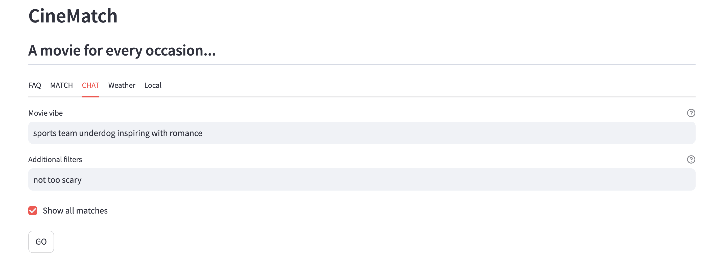

# CineMatch
> An example of **GenAI-powered personalization** in retail - illustrated using movies.

The (ficticious) retailer **CineMatch** is a movie subscription service. 
The success of CineMatch depends on keeping their customers engaged so they do not cancel their subscriptions.
CineMatch uses segmentation and recommendation engines, but would like to explore the use of GenAI for dynamic personalization.



The solution is a slight variation on the basic RAG format. About 35,000 movie plots were embedded and stored in a FAISS database.
Based on a signal from the user (which can be direct or indirect) an LLM creates a generic scenario and then looks for semantically similar movie plots. A second LLM compares the ranked results with the user's original signal to personalize the suggestion.  A chat window captures direct input from the user (called "the vibe"). A user can also provide additional context (e.g. "not too scary"). External signals include scenarios based on weather forecast, local events, and social media topics and trends. 

## System Requirements
- Open AI key and active LLM & Embedding deployments
- Weather API key for the external signal source
- FAISS for vector storage and retrieval (need reasonable storage space and memory available)
- Streamlit runs the app

## Installation
create environment & install requirements
```
python -m venv .venv
source .venv/bin/activate
pip install -r requirements.txt
```

copy the env.example file and fill in your endpoints and API key
```
cp .env.example .env
replace the api, endpoint and model names as needed
```

create the index using the plots file provided. This may take up to 30 minutes.
```
mkdir .index
python faiss.py
```

run the application
```
deactivate
source .venv/bin/activate
python -m streamlit run lit1.py
```

## Limitations / Improvements
This code comprises a POC which isn't intended for production.
To deploy the system, a developer might have the following considerations...
1. **Evaluation framework** - processes to measure the quality of the system can be added in three main areas: 1) the relevance of the generic movie plot based on the input (either from the user or the external signal). 2) The ability of the search process to retrieve a specific movie can be measured by selecting a random movie, creating a generic plot, and then noting where the original movie returns in the search. 3) The final suggestion to the user can be compared against the original request and the context for groundedness.
2. ***Feedback loop*** - the thumbs feedback options are provided on matching movies in the POC but are ornamental only. Activating the feedback method would allow collecting data for measuring accuracy and improving the system performance.
3. ***Search Quality*** - the POC leverages a one-step semantic search returning N closest matches. Using the meta data of movies (like year,rating, and genre) for filtering searches would improve the relevance of returned items.
4. ***Product Descriptions*** - the POC uses product descriptions (i.e. movie plots) for matching purposes. Depending on the product and data quality, there might additional customer descriptions (i.e. movie reviews). Adding reviews into the vector database would provide a richer set of descriptions to match unique scenarios. 

## Responsible AI Considerations
Before exposing a customer to the AI solution, several risks should be evaluated and mitigated. 
1. Exposing a user directly to an LLM can result in accidental or intentional misuse. This harm is mitigated somewhat in that the first LLM translates the user input into a generic movie plot. Further safeguards should be considered.
2. The user could be exposed to content that they find objectionable. Current mitigation relies on safety guardrails from the LLM and the option of the user to provide more context (i.e. "not too scary" or "family friendly"). Additional user controls 
3. The inclusion of external sources could introduce privacy issues and the potential for becoming a nuisance to the user. Consideration should be given to the user to make sure they understand what data will be included and how it will be used.  
